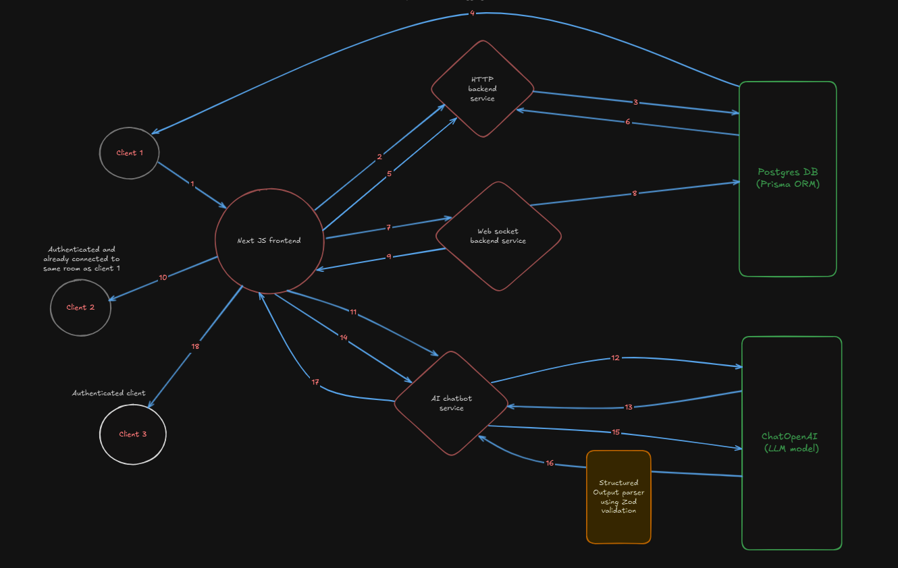

# Scriblio System Design

## Architecture Diagram

---

## Flow of the System

1. Client submits login credentials to the HTTP backend service via the Next.js frontend.  
2. HTTP backend verifies/inserts the credentials using a Postgres database via an ORM called Prisma client.  
3. Backend service stores the JWT token on the client/browser's local storage.  
4. Frontend tries to connect to a Drawing room from the redirected Dashboard. A request goes out to the DB to fetch existing shapes in that room.  
5. DB returns the existing shapes and they are rendered on the frontend canvas.  
6. Frontend connects to a WebSocket channel and tries to draw some shapes on the canvas.  
7. The shapes are stored in JSON format in the Postgres DB.  
8. The same shapes are broadcasted to all clients connected to the same room from which the shapes were received.  
   - *(Note: Steps 7 and 8 could be optimized by using a Redis queue service to reduce latency in WebSocket broadcast.)*  
9. The same shapes are rendered on the canvas of another client connected to the same room.  
10. A third client prompts the AI chatbot service to generate a specific drawing using the `generate-drawing/init` endpoint.  
11. Since the `init` endpoint was hit, the chatbot service instantiates the bot class and maps the session ID with this bot. It triggers the `nextClarifyingQuestion` function.  
12. The model returns clarifying questions to the chatbot service. The chatbot service attaches the sessionId and clarifying question in the response and sends back to the frontend.  
13. Based on the clarifying question, the client answers them and sends back to the model along with the sessionId to the chatbot service so that it can keep track of the corresponding bot.  
    - *(This process continues until the `questionsLimit` is reached, as defined in the bot class.)*  
14. Once the `questionsLimit` is reached, based on the `messageHistory` a prompt is generated with complete context of the situation and sent to the LLM.  
15. The JSON output generated is first parsed using a **Zod schema** to ensure it matches the schema used on the frontend.  
16. This JSON is returned to the frontend.  
17. The JSON is rendered on the HTML canvas and displayed on the drawing board to the client.  
18. Once the client accepts it, the message is broadcasted to all other members of the room via the WebSocket server.  
19. Further, the same steps are followed as mentioned in **7, 8, and 9**.  

---

## Notes
- Authentication handled via **JWT** stored on the client-side.  
- Persistent storage of drawings and chat flow handled by **Postgres + Prisma**.  
- **WebSocket** enables real-time sync of shapes across connected clients.  
- **Redis Queue (optional)** could be added to improve broadcast latency.  
- **AI chatbot service** orchestrates clarifying questions, session tracking, and LLM integration.
